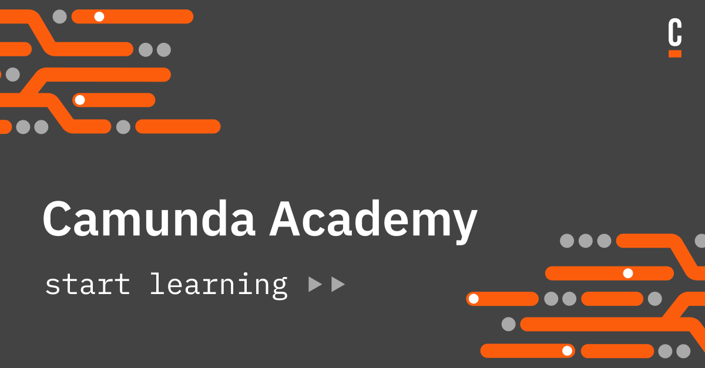

# Welcome to the Camunda Academy!

## Table of Contents
* [	ℹ General Info](#general-information)
* [📚 Course catalog](#course-catalog)
* [:bowtie: Team members](#team-members)
* [:speech_balloon: Contact](#contact)
<!-- * [License](#license) -->

## ℹ General Information

> 👉 Our vision is to increase the number of individuals and organizations with the knowledge and skills required to be successful with Camunda

> 👉 Our mission is to ensure that Camunda users can seamlessly acquire the knowledge and skills needed to solve their process automation challenges

## 📚 Course Catalog

### On Demand
- [How to](https://academy.camunda.com/page/how-to)
- [BPMN](https://academy.camunda.com/page/bpmn)
- [DMN](https://academy.camunda.com/page/dmn)
- [Camunda 8](https://academy.camunda.com/page/camunda-8)
- ... and more!

### Learning Paths
- [Camunda 8 - Getting Started](https://academy.camunda.com/path/c8-lp-getting-started)
- [Camunda 8 - Developer](https://academy.camunda.com/path/c8-lp-developer)
- [Camunda 8 - Administrator](https://academy.camunda.com/path/c8-lp-administrator)
- [Camunda 8 - Architect](https://academy.camunda.com/path/c8-lp-architect)
- [Camunda 8 - Business Analyst](https://academy.camunda.com/path/c8-lp-business-analyst)
- [Camunda 8 - Team Member](https://academy.camunda.com/path/c8-lp-team-member)

### Instructor Led
- [BPMN 2.0](https://academy.camunda.com/page/instructor-led)
- [DMN](https://academy.camunda.com/page/instructor-led)
- [Camunda 8 - Platform for Developers](https://academy.camunda.com/page/instructor-led)

### Adoption Plan
- [Camunda Adoption Plan](https://academy.camunda.com/plan/adoption)

## :bowtie: Team Members

### Education (Contributors)

* [Enrico Curiotto](https://github.com/ecuriotto)
* [Ingo Richtsmeier](https://github.com/ingorichtsmeier)
* [Hendrik Kupitz](https://github.com/hkupitz)
* [Manuel Dittmar](https://github.com/ManuelDittmar)

### Education (Core)

* [Darren Devine](https://github.com/darrendevine)
* [Ancuta Dida](https://github.com/AncutaDida)
* [Jana Eschwaltrup](https://github.com/JanaEsch)
* [Marius Dragan](https://github.com/MariusODr)
* [Víctor García](https://github.com/goenkale)
* [Tara Swenson](https://github.com/taraswenson)

### Web Marketing

* [David Paradis](https://github.com/davidparadis)

## :speech_balloon: Contact

Created with love ❤ by the Camunda Education Team - feel free to [contact us](mailto:academy@camunda.com) 💌 !
